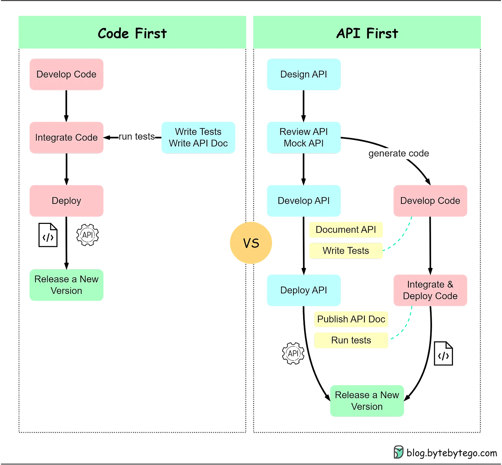
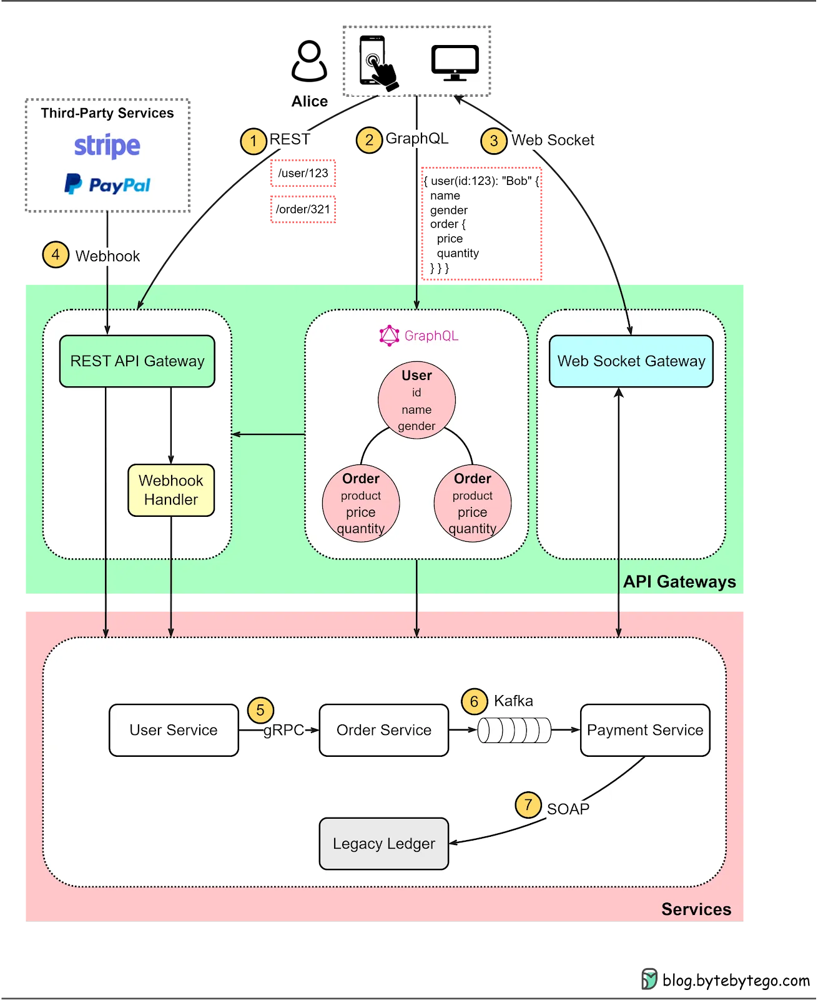
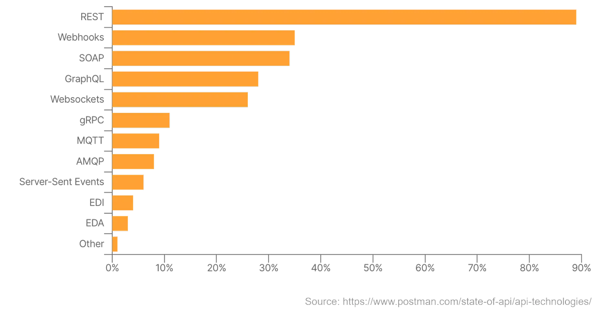
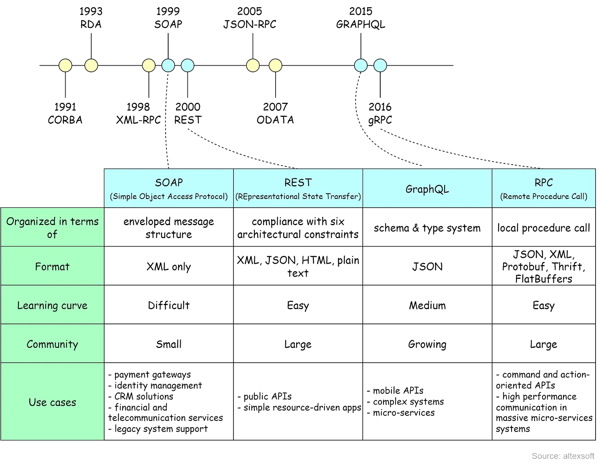

# API Design

> Sources: ByteByteGo (Alex Xu), 2023-05-10; ByteByteGo (Alex Xu), 2023-05-17
> Raw:
> [Mastering the Art of API Design](../../raw/system-design/2023-05-10-mastering-art-of-api-design.md);
> [Design Effective and Secure REST APIs](../../raw/system-design/2023-05-17-design-effective-secure-rest-apis.md)

## Overview

APIs define how system components interact. As monolithic applications decompose
into microservices and serverless functions, in-process calls become
inter-process calls across networks — making disciplined API design critical.
This article covers the "API First" development model, surveys seven major API
architectural styles, discusses how to detect API design issues, and dives into
REST API maturity levels and best practices.

## API First

"API First" prioritizes API design before system implementation. Teams
(frontend, backend, QA) collaborate on API specifications upfront, then work
independently against that shared contract.

### Code First vs API First

| Aspect        | Code First                                    | API First                                     |
| ------------- | --------------------------------------------- | --------------------------------------------- |
| API role      | Byproduct of implementation ("documentation") | Driving force of the entire development cycle |
| Collaboration | Teams discover interfaces during integration  | Teams agree on interfaces before coding       |
| Testing       | APIs tested after implementation              | API-driven tests from the start               |

### Benefits

- **Improved system integration** — Forces developers to think about
  interactions from the outset, reducing mid-development rework.
- **Enhanced collaboration** — APIs as shared specs let developers, testers, and
  DevOps work independently with fewer uncertainties.
- **Increased scalability** — Defined interfaces make scaling easier (spin up
  instances, adjust load balancers).
- **Network effects** — Systems become composable building blocks. Jeff Bezos's
  2002 API mandate at Amazon turned internal services into an open ecosystem,
  eventually becoming AWS.

## API Architectural Styles

### REST (Representational State Transfer)

Introduced in 2000 by Roy Fielding. The most widely used style for client-server
communication.

Every component is a **resource** accessed via standard HTTP methods (GET, POST,
PUT, DELETE). Payloads can be JSON, XML, HTML, or plain text.

**Six architectural constraints:**

1. **Uniform interface** — Define API interfaces for resources
2. **Client-Server** — Client and server evolve separately
3. **Stateless** — Every request is treated as new; no server-side session state
4. **Cacheable** — Responses are cached wherever possible
5. **Layered system** — APIs, services, and data can live on different servers
6. **Code on demand** (optional) — Server can return executable code

### GraphQL

Proposed in 2015 by Meta. Provides a schema and type system for complex systems
with graph-like relationships. One query can fetch nested data from multiple
entities that would require multiple REST calls.

**Key insight**: GraphQL is not a replacement for REST — it can be built on top
of existing REST services, making migration less invasive.

**Trade-offs**:

- Can expose more resource fields than necessary if queries aren't carefully
  designed
- Caching is more challenging due to query flexibility
- Steeper learning curve (new query language + schema design)

### WebSocket

Full-duplex communication over TCP. Unlike REST's pull model, WebSocket pushes
data to clients in real-time. Used in online gaming, stock trading, and
messaging apps.

### Webhook

Asynchronous callbacks for third-party integration. One application registers a
URL to receive updates from another. Widely adopted in SaaS (e.g., Stripe/PayPal
payment result notifications). Webhook calls typically form part of a system's
state machine.

### gRPC

Released in 2016 by Google. Modern RPC framework for server-to-server
communication in distributed systems.

- Uses **Protocol Buffers** for serialization (compact, fast)
- **Code generation** tools produce client/server stubs automatically
- Based on **HTTP/2** — supports multiplexing and streaming

**Caveat**: RPC frameworks make remote calls look like local calls, masking
network unreliability. Developers must handle dropped responses and intermittent
failures explicitly.

### SOAP

Simple Object Access Protocol. Uses XML payloads. Primarily found in legacy
enterprise internal systems.

### Kafka (Event Streaming)

Not request-response — Kafka provides a **publish-subscribe** messaging paradigm
for asynchronous, event-driven communication.

**When to use over REST**:

- Slow downstream services (e.g., payment processing) — avoid blocking the
  caller
- **Fan-out** — one event needs to reach multiple consumers. Request-response
  fan-out quickly becomes unmaintainable

## Popularity (Postman Survey)

| Style    | Adoption |
| -------- | -------- |
| REST     | 89%      |
| Webhooks | 35%      |
| GraphQL  | 28%      |
| gRPC     | 11%      |

> gRPC is used for internal microservices; GraphQL for stitching together
> disparate data sources.

## Choosing the Right Style

Each style was designed for a specific purpose:

| Pattern       | Best For                                                              |
| ------------- | --------------------------------------------------------------------- |
| **REST**      | General client-server CRUD, public APIs                               |
| **GraphQL**   | Complex data graphs, multiple client types with different data needs  |
| **WebSocket** | Real-time bidirectional communication (gaming, trading, chat)         |
| **Webhook**   | Third-party async notifications, SaaS integrations                    |
| **gRPC**      | Internal microservice-to-microservice, high-performance RPC           |
| **SOAP**      | Legacy enterprise integrations (declining)                            |
| **Kafka**     | Event-driven, async workflows, fan-out, decoupling fast/slow services |

In extreme scenarios (e.g., low-latency trading), none of these styles may be
suitable — proprietary protocols may be required.

## See Also

- [GraphQL](graphql.md)
- [REST API](rest-api-design.md)
