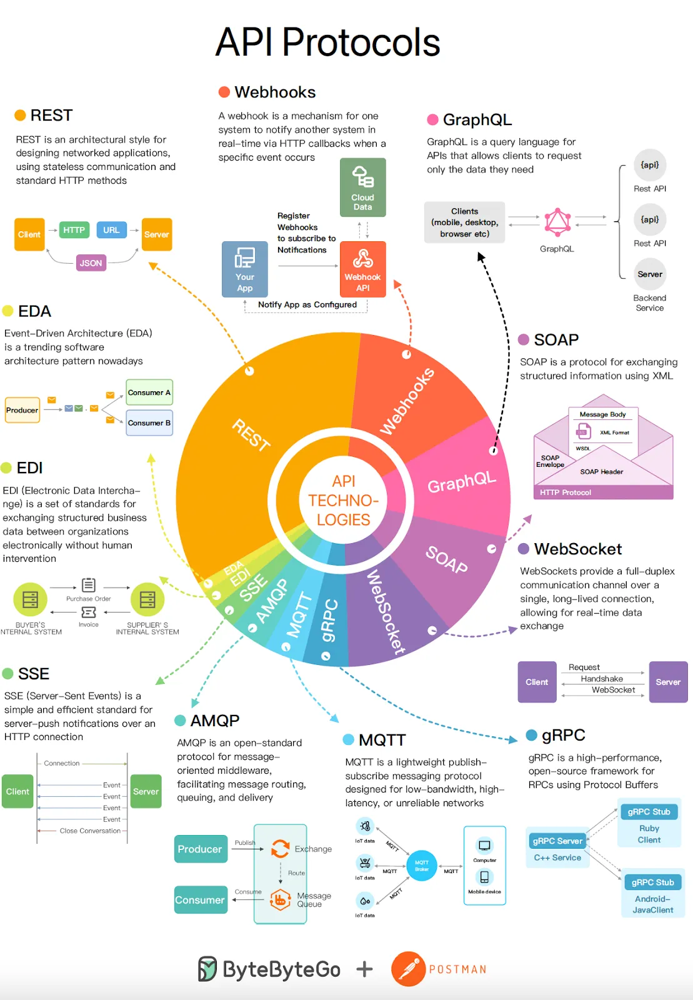
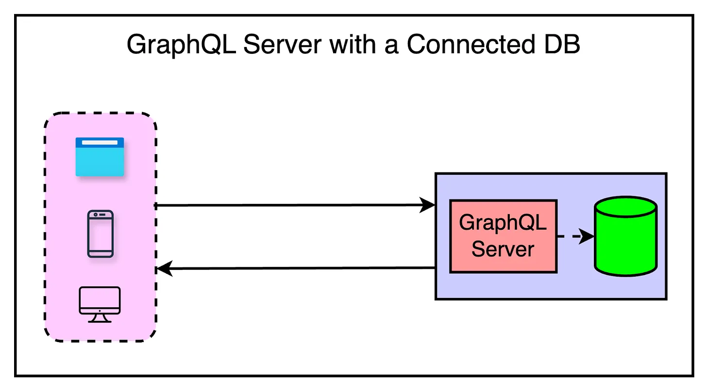
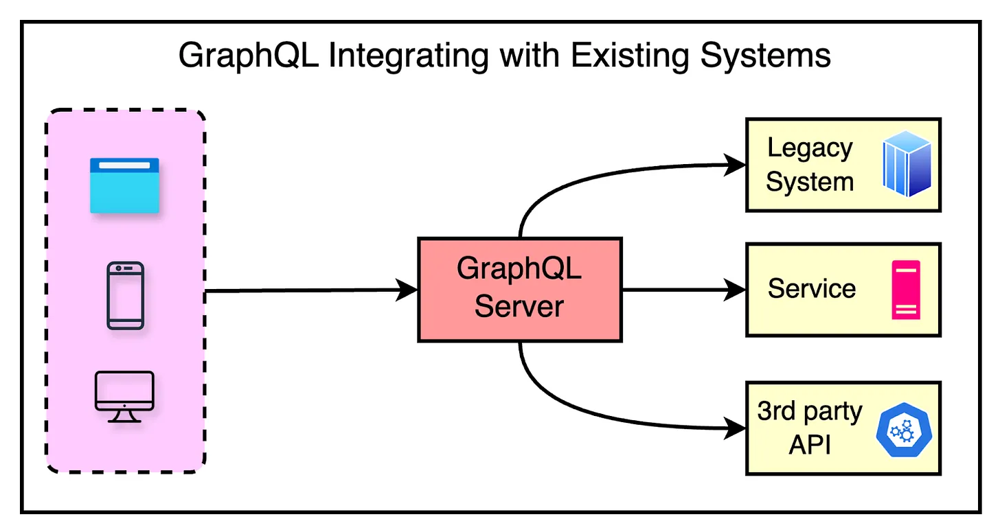
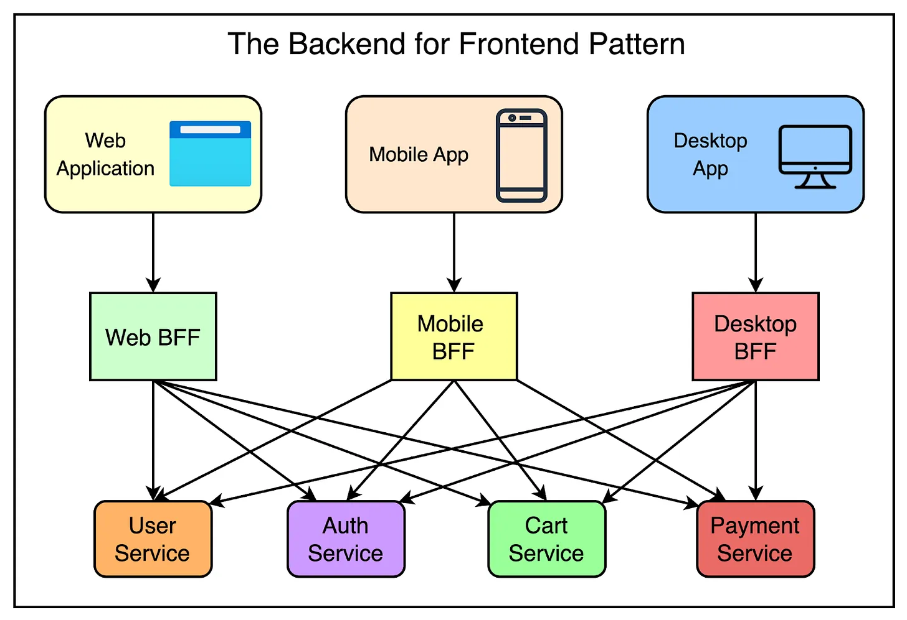
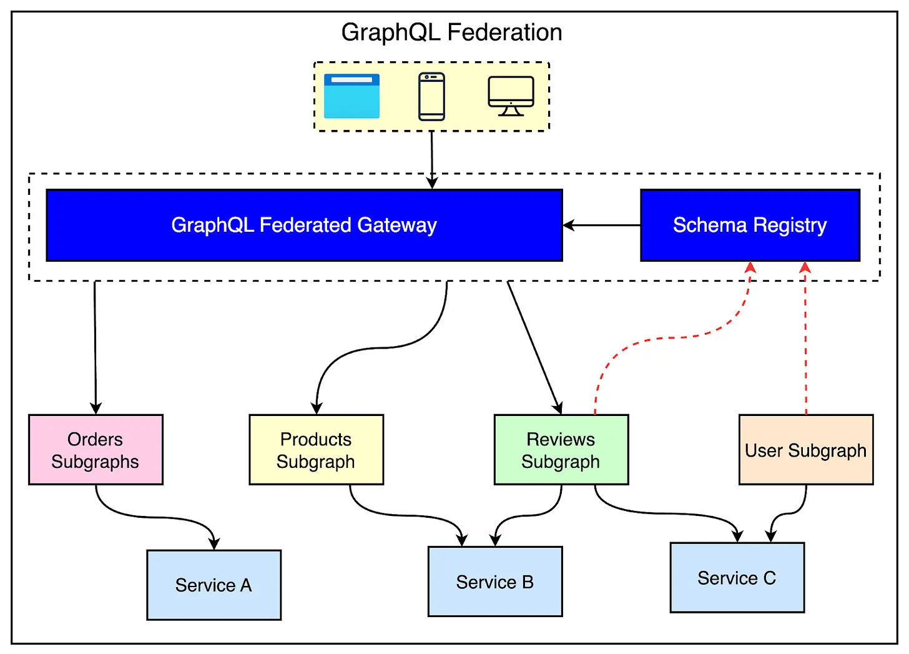
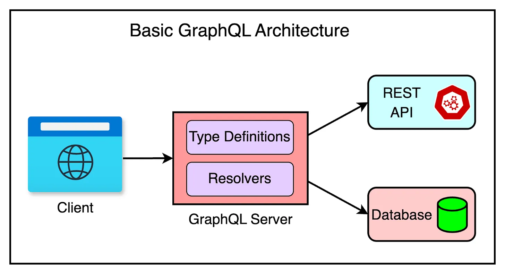

# GraphQL

> Sources: ByteByteGo (Alex Xu), 2024-05-16; ByteByteGo (Alex Xu), 2024-09-25
> Raw: [A Crash Course in GraphQL](../../raw/system-design/2024-05-16-crash-course-in-graphql.md); [GraphQL 101](../../raw/system-design/2024-09-25-graphql-101-api-approach-beyond-rest.md)

## Overview

GraphQL (Graph Query Language) is an open-source query language and runtime for APIs, originally developed at Facebook in 2012 and publicly released in 2015. It addresses core limitations of REST — overfetching, underfetching, and the n+1 problem — by letting clients declare the exact shape of the data they need through a single endpoint. GraphQL is strongly typed, supports real-time subscriptions, and can be adopted incrementally from client-side wrappers all the way to federated supergraph architectures.


## Origin and Motivation

Facebook created GraphQL while building a native iOS news feed. REST APIs proved problematic for mobile:

- **High latency** from multiple roundtrip requests over flaky connections.
- **Cumbersome coordination** across different data models.
- **API fragmentation** requiring careful client-side adaptation to prevent crashes.
- **Stale documentation** that drifted from the actual implementation.

GraphQL was open-sourced in 2015 and transferred to the GraphQL Foundation (under the Linux Foundation) in 2018. It now has broad industry adoption.

## Core Mental Model — The Vending Machine

REST is like a vending machine with one button per item — five items require five button presses. Creating "combo buttons" (aggregation endpoints) doesn't scale because the number of possible combinations is effectively infinite.

GraphQL flips this: the client tells the machine exactly which items it wants, and the machine delivers them all in one response.

## Key Features

### Declarative Queries

Clients specify exactly which fields they need. The server returns only those fields — nothing more, nothing less.

```graphql
{
  book(id: "1") {
    title
    publishYear
  }
}
```

### Hierarchical Structure

Queries mirror the shape of the response, allowing nested related data in a single request:

```graphql
{
  book(id: "1") {
    title
    authors { name }
  }
}
```

### Strong Typing

Every field has a declared type. The `!` suffix means non-nullable. The type system validates queries before execution, producing clear error messages.

```graphql
type Book {
  title: String!
  publishYear: Int
  price: Float
}
```

## Building Blocks

| Concept | Purpose |
|---------|---------|
| **Schema (SDL)** | Defines types, fields, relationships, and allowed operations |
| **Query** | Read operation — client declares the data shape it needs |
| **Mutation** | Write operation — create, update, or delete data |
| **Subscription** | Real-time push — server sends data when an event occurs (uses a persistent connection) |
| **Resolver** | Server-side function that fetches actual data for each field in a query |

### Schema Definition Language (SDL)

```graphql
type Author {
  name: String!    # '!' = required field
}
```

### Mutations

```graphql
mutation {
  createBook(title: "System Design Interview Volume 2", publishYear: "2022") {
    name
    country
  }
}
```

### Subscriptions

```graphql
subscription {
  newAuthor {
    name
    country
  }
}
```

The connection stays open; whenever a `newAuthor` mutation fires, the server pushes the event payload to all subscribers.

### Resolvers

Resolvers are server-side functions that fetch the actual data when a query, mutation, or subscription is executed. Each field in the schema can have its own resolver. For example, a `user` query resolver might call a database function, while an `orders` field resolver might call a separate microservice. Resolvers can be simple (direct DB lookup) or complex (aggregating from multiple sources), but they are always tied to the schema.

## Request Lifecycle

A GraphQL request follows a predictable four-stage lifecycle:

1. **Client sends query** — All operations (queries, mutations, subscriptions) go to a single endpoint (typically `/graphql`). The request body contains the query itself.
2. **Parsing & Validation** — The GraphQL engine parses the query structure and validates it against the schema. Requests for non-existent fields are rejected immediately.
3. **Execution** — The server runs resolvers for each requested field, fetching data from databases, services, or other backends.
4. **Response** — Results are collected and returned as JSON. The response shape mirrors the query shape exactly — no extra fields.

## Architectural Patterns

### GraphQL Server + Database

The simplest greenfield setup: a single server resolves queries by reading from a database (SQL or NoSQL — GraphQL is database-agnostic).

### GraphQL Server with Existing Systems

A GraphQL server sits in front of multiple existing systems (microservices, legacy APIs, third-party services) and provides a unified API surface to clients.


## GraphQL vs REST

| Dimension | REST | GraphQL |
|-----------|------|---------|
| Endpoints | One per resource | Single endpoint |
| Data shape | Fixed per endpoint | Client-specified |
| Overfetching | Common — all fields returned | Eliminated — only requested fields |
| Underfetching | Common — n+1 problem | Eliminated — nested queries in one request |
| Versioning | Explicit versions (`/v1/`, `/v2/`) create maintenance overhead | Schema evolution — add fields freely, deprecate old ones |
| Type safety | No built-in type system; relies on external docs | Strong type system acts as a live contract |
| Flexibility | Low — new endpoints for new shapes | High — any combination of fields |

REST's overfetching, underfetching, versioning overhead, and lack of a built-in type system are the primary pain points GraphQL solves.

## GraphQL vs Backend-for-Frontend (BFF)

The BFF pattern creates dedicated backend services per client type (web, mobile, etc.). While it gives frontend teams autonomy, it causes "BFF sprawl":

- Each BFF requires independent development and maintenance.
- BFFs can still suffer from over/underfetching internally.
- Duplication of logic grows as the number of clients increases.

GraphQL replaces BFFs by offering a single, flexible endpoint that each client queries differently.

## GraphQL Federation

A monolithic GraphQL server runs into scaling problems:

- **Schema complexity** becomes unmanageable.
- **Team bottlenecks** — one team owns all changes.
- **Lack of domain authority** — schema changes risk cross-domain breakage.

**Federation** decomposes the monolith into **subgraphs**, each owned by a domain team:

| Component | Role |
|-----------|------|
| **Subgraph** | Focused schema for one domain (e.g., Products, Reviews, Users) |
| **Schema Registry** | Central repository of all subgraph schemas |
| **Federation Gateway** | Stitches subgraphs into a unified **supergraph** and routes queries |

To clients, the supergraph looks like a single coherent schema, but ownership and deployment are decoupled.



### Federation Directives (Apollo Federation)

Federation uses special directives to coordinate across subgraphs:

| Directive | Purpose |
|-----------|---------|
| `@key` | Uniquely identifies an entity (e.g., `User` by `id`) so the gateway can look it up across subgraphs |
| `@extends` | Allows one service to add fields to a type defined in another service |
| `@provides` | Declares which fields a service can supply when resolving a related type |

Example: the Accounts service defines the `User` type with `@key(fields: "id")`. The Orders service uses `@extends` to add an `orders` field to `User`. The gateway knows how to stitch both together.

### Federation vs Schema Stitching

Schema stitching was an earlier approach to combining multiple GraphQL schemas. It required manually merging schemas and writing custom resolution code, which became brittle at scale. Federation was designed to replace stitching — it provides a structured, predictable way for many teams to contribute to a single graph without stepping on each other.

## Adoption Patterns (Incremental)

Teams typically begin with a basic architecture — a client queries a single GraphQL server that distributes requests to backing data sources. From there, multiple sub-patterns emerge as the system evolves.



### Client-based GraphQL

Client teams wrap existing REST/legacy APIs behind a single GraphQL endpoint on the client side. This improves the developer experience by giving clients a unified query interface.

**Trade-off**: The client still bears the performance cost — it makes multiple network requests to various backend services under the hood.

### GraphQL with BFFs

Each client type (web, mobile, desktop) gets a dedicated BFF service, and GraphQL is used as the intermediary layer within each BFF. This solves the client-side performance problem since the BFF aggregates data server-side.

**Trade-off**: Building and maintaining separate BFFs adds overhead, and there is a risk of duplicating effort between teams.

### Monolithic GraphQL

Multiple teams share a single GraphQL server codebase accessed by all clients. Alternatively, a single team owns the GraphQL API that multiple client teams consume.

**Trade-off**: Creates ownership challenges — portions of the schema may suit one client's needs while forcing others to find workarounds. The owning team can become a development bottleneck.

### Supergraph (Federation)

Consolidates multiple graphs into a single supergraph with federated ownership. Each domain team owns a subgraph; a router composes them into one unified schema.

This is the recommended long-term architecture for large organizations — it provides a single entry point for clients while keeping domain ownership decoupled. See [GraphQL Federation](#graphql-federation) above for the full architecture.

## Real-World Use Cases

- **Mobile applications** — Mobile clients have limited bandwidth and different data needs than desktop. GraphQL lets a mobile app request a minimal field set while the web app fetches richer data — same endpoint, different queries.
- **Microservice orchestration** — A single GraphQL query can pull data from dozens of backend microservices (users, orders, payments), giving the client one clean response instead of managing multiple REST calls.
- **Legacy system bridging** — A GraphQL layer on top of legacy REST APIs, SOAP services, or SQL databases provides a modern query interface. As legacy systems are replaced, the GraphQL schema evolves while client queries remain stable.

## Ecosystem Tools

| Tool                      | Description                                                                                     |
| ------------------------- | ----------------------------------------------------------------------------------------------- |
| **Apollo Server**         | Production-ready GraphQL server with federation support and advanced features                   |
| **GraphQL Yoga**          | Lightweight, flexible alternative for smaller projects                                          |
| **Hasura**                | Instantly generates GraphQL APIs on top of databases with minimal setup                         |
| **GraphQL Mesh**          | Connects multiple sources (REST, gRPC, databases) and presents them as a unified GraphQL schema |
| **GraphiQL / Playground** | Browser-based IDEs for schema exploration, testing, and documentation                           |

## Best Practices

- **Schema Design**: Keep schemas simple with consistent naming. Avoid deep nesting and circular dependencies.
- **Query Optimization**: Use server-side batching (e.g., DataLoader) and caching to avoid redundant backend calls.
- **Versioning**: Prefer schema evolution over versioning — use deprecation, nullability, and default values for non-breaking changes.
- **Security**: Apply the same practices as REST — authentication, authorization, rate limiting, and query depth/complexity limits.
- **Tooling**: Use GraphiQL or GraphQL Playground for development and testing; leverage mature server libraries (Apollo Server, graphql-yoga, etc.).

## See Also

- [Authentication Methods](authentication-methods.md)
